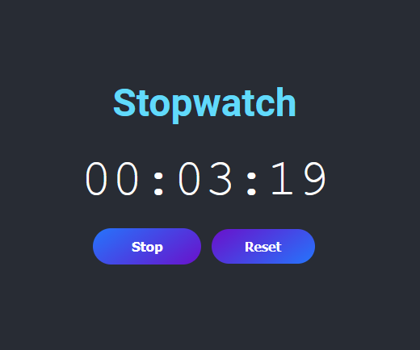

# React - Stopwatch

# 🔗 [Live Preview](https://6696e6bcd13a7c3a0d6727c5--dreamy-sunburst-360b52.netlify.app/)

---

## About 👋

A simple stopwatch application built with React. The application allows users to start, stop, and reset the stopwatch. The user interface is designed with modern styling for a better user experience.

---

## Features 👨‍💻

- Start and stop the stopwatch
- Reset the stopwatch
- Responsive and modern design

---

## Languages

- React: functions, conditionals, useState, useEffect
- Styling: basic
